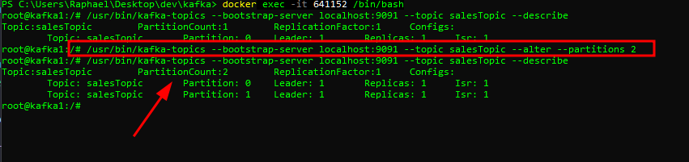
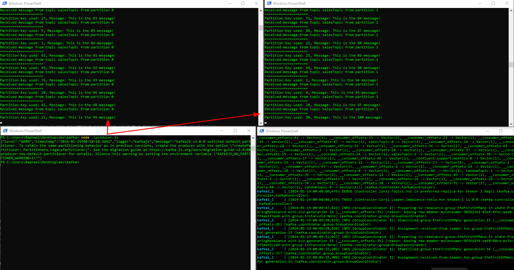

# Kafka basics

## Requirements
- [Docker / Docker-compose](https://docs.docker.com/)
- [Node](https://nodejs.org/en/download/current) (version 20 or greater)

## Basic setup
1. Clone this repository
2. Navigate using your terminal and use the `npm ci` (or `npm install`) command to install this project dependencies

## Running application

1. Change the value assigned to "MY_IP" variable in 'consumer.js' and 'producer.js' files (only if the 'localhost' doesn't work)
2. Open 4 terminal instances
    - 1 will be responsible to setup our (zookeeper + kafka) infrastructure
    - 1 will be responsible for producing (a.k.a send) the message.
    - 2 will be responsible for consuming the message.
3. Use one terminal to navigate through the directories and when you are inside this cloned repo, use the `docker-compose up` command to setup the environment

5. Now, let's start our consumers.
Use the command `node ./consumer.js` on 2 different instances of your terminal.
6. Now, keep your consumers terminal visible and on another terminal instance use the command `node ./producer.js`

You will notice that one of your consumer terminal will log all 100 messages, even though we are setting the 'key' argument on the producer to be random.

That's because as we have:
2 consumer instances (both in the same groupId) and only 1 partition, the last consumer that connected will be idle

By default, this kafka will run with only 1 partition for our 'salesTopic' as we are creating it by producing a message and not setting this up before it, but we will change it now to show you how kafka balances the message distribution.

Let's stop our consumers (Just stop, you don't need to close both terminal windows, we are going to use them later. You can use Ctrl+C on terminal as shortcut).

## Scaling partitions
1. Use the command `docker ps` to see which containers you are running, we are going to use the "container id" of our kafka.
2. Use the command `docker exec -t YOUR_KAFKA_CONTAINER_ID /bin/bash` replacing the YOUR_KAFKA_CONTAINER_ID for your actual container id from the `docker ps` command
3. As you enter on the interactive shell of your kafka container, we have some tools at our disposal.

Let's first, check how many partitions we do have:
`/usr/bin/kafka-topics --bootstrap-server localhost:9091 --topic salesTopic --describe`

It's only one, right? Let's change it.

Use the following command
`/usr/bin/kafka-topics --bootstrap-server localhost:9091 --topic salesTopic --alter --partitions 2`

This command will call a kafka-topics script which will increase our partitions to 2 (using the parameter `--alter --partitions`)

Now use the command `/usr/bin/kafka-topics --bootstrap-server localhost:9091 --topic salesTopic --describe` again and now we have 2 partitions!

Now, start again both consumers again and go back to our terminal where we first used the command `node ./producer.js` and let's use it again, but now, having 2 partitions AND 2 consumers.

See the difference? Now, there's 2 partitions available, so our consumers are now taking turns on processing each event produced.

## Reassuring event order
If the consuming order is important for you, you can use the same 'partitionKey' to make sure the same consumer will handle them.
You can try it just by replacing the random partitionKey assigned on line 15 on file `producer.js`.
For example, change it to `12345` (Usually something like an `id` for identification) and still having our topic with 2 partitions.

If we run our producer again using `node ./producer.js`, all 100 events are going to be consumed by the same instance.

